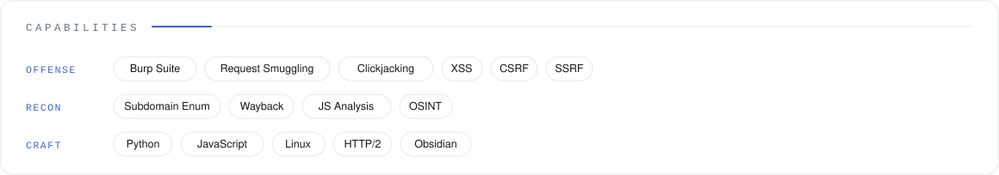
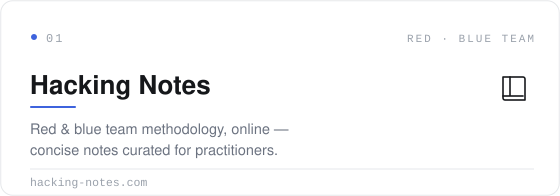
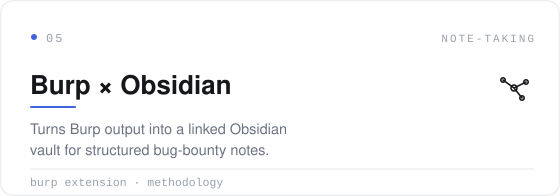
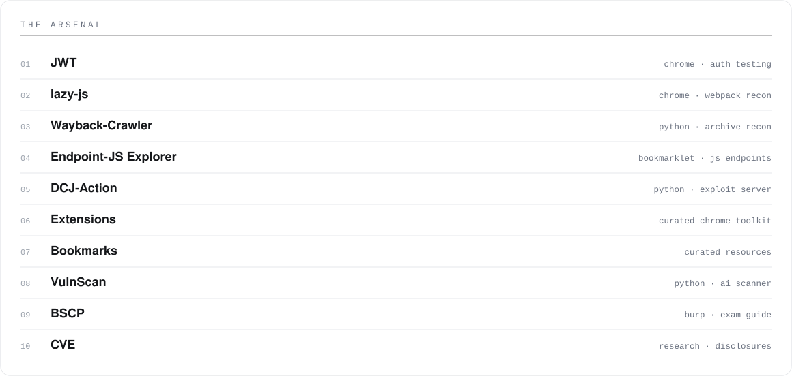
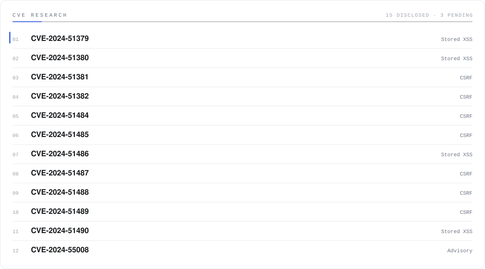

<a name="top"></a>

<div align="center">

<picture><source media="(prefers-color-scheme: dark)" srcset="assets/hero-dark.svg"></picture>

<br />

<a href="https://github.com/Hacking-Notes?tab=followers"><picture><source media="(prefers-color-scheme: dark)" srcset="assets/hdr-followers-dark.svg"></picture></a>
&nbsp;<a href="https://hacking-notes.com"><picture><source media="(prefers-color-scheme: dark)" srcset="assets/hdr-website-dark.svg"></picture></a>
&nbsp;<a href="https://hacking-notes.medium.com/"><picture><source media="(prefers-color-scheme: dark)" srcset="assets/hdr-blog-dark.svg"></picture></a>
&nbsp;<a href="https://discord.gg/r68ameNHrD"><picture><source media="(prefers-color-scheme: dark)" srcset="assets/hdr-discord-dark.svg"></picture></a>

</div>

<br />

```console
$ whoami
Security researcher. I build offensive tooling, document red & blue
team methodology, and disclose vulnerabilities responsibly.

$ cat ~/.motto
True power lies in the ability to see what others cannot.
```

<picture><source media="(prefers-color-scheme: dark)" srcset="assets/skills-dark.svg"></picture>

<br />

## Featured Work

<div align="center">

<a href="https://hacking-notes.com"><picture><source media="(prefers-color-scheme: dark)" srcset="assets/cards/notes-dark.svg"></picture></a>
&nbsp;<a href="https://github.com/Hacking-Notes/Hacker-Roadmap"><picture><source media="(prefers-color-scheme: dark)" srcset="assets/cards/roadmap-dark.svg"></picture></a>

<a href="https://github.com/Hacking-Notes/ClickMe"><picture><source media="(prefers-color-scheme: dark)" srcset="assets/cards/clickme-dark.svg"></picture></a>
&nbsp;<a href="https://github.com/Hacking-Notes/Burp-Suite-Obsidian-Integration"><picture><source media="(prefers-color-scheme: dark)" srcset="assets/cards/obsidian-dark.svg"></picture></a>

</div>

<br />

## The Arsenal

<div align="center">

<picture><source media="(prefers-color-scheme: dark)" srcset="assets/arsenal-dark.svg"></picture>

</div>

<sub>
  <a href="https://github.com/Hacking-Notes/HR-Smuggler">HR-Smuggler</a> ·
  <a href="https://github.com/Hacking-Notes/Subdomain-Takeover">Subdomain-Takeover</a> ·
  <a href="https://github.com/Hacking-Notes/jwt">JWT</a> ·
  <a href="https://github.com/Hacking-Notes/lazy-js">lazy-js</a> ·
  <a href="https://github.com/Hacking-Notes/Wayback-Crawler">Wayback-Crawler</a> ·
  <a href="https://github.com/Hacking-Notes/Endpoint-Javascript-Explorer">Endpoint-JS Explorer</a> ·
  <a href="https://github.com/Hacking-Notes/dcj-action">DCJ-Action</a> ·
  <a href="https://github.com/Hacking-Notes/Extensions">Extensions</a> ·
  <a href="https://github.com/Hacking-Notes/Bookmarks">Bookmarks</a> ·
  <a href="https://github.com/Hacking-Notes/VulnScan">VulnScan</a> ·
  <a href="https://github.com/Hacking-Notes/BSCP">BSCP</a> ·
  <a href="https://github.com/Hacking-Notes/CVE">CVE</a>
</sub>

<br />
<br />

## Contributions

<picture><source media="(prefers-color-scheme: dark)" srcset="assets/bugbounty-dark.svg"></picture>

<br />

<a href="https://github.com/Hacking-Notes/CVE"><picture><source media="(prefers-color-scheme: dark)" srcset="assets/cve-dark.svg"></picture></a>

<br />
<br />

<picture><source media="(prefers-color-scheme: dark)" srcset="assets/footer-dark.svg"></picture>

<div align="right"><sub><a href="#top">↑ back to top</a></sub></div>
