<a name="top"></a>

<div align="center">



<br />

<a href="https://github.com/Hacking-Notes"></a>
<a href="https://hacking-notes.com"></a>
<a href="https://hacking-notes.medium.com/"></a>
<a href="https://discord.gg/r68ameNHrD"></a>

</div>

<br />

```console
$ whoami
Passionate cyber security enthusiast — building tools, breaking apps,
and documenting the path from script kiddie to security professional.

$ cat ~/.motto
"True power lies in the ability to see what others cannot."
```

<details>
  <summary><b>🐛 &nbsp;Bug Bounty Contributions</b></summary>
  <br />
  <kbd> <br> Search Engine <br> </kbd>᲼᲼<kbd> <br> Governments / Municipalities <br> </kbd>᲼᲼<kbd> <br> Domain Providers <br> </kbd>᲼᲼<kbd> <br> Hotel Chains <br> </kbd>᲼᲼<kbd> <br> ... <br> </kbd>
  <p>📒 Discover more about my related work in my <a href="https://bug-bounty.blog/">blog articles</a>.</p>
  <br />
</details>

<details>
  <summary><b>🤝 &nbsp;CVE Contributions</b></summary>
  <br />
  <kbd> <br> <a href="https://github.com/Hacking-Notes/CVE/blob/main/CVE-2024-51490.md">CVE-2024-51490</a> <br> </kbd>᲼᲼<kbd> <br> <a href="https://github.com/Hacking-Notes/CVE/blob/main/CVE-2024-51486.md">CVE-2024-51486</a> <br> </kbd>᲼᲼<kbd> <br> <a href="https://github.com/Hacking-Notes/CVE/blob/main/CVE-2024-51489.md">CVE-2024-51489</a> <br> </kbd>᲼᲼<kbd> <br> <a href="https://cve.mitre.org/">CVE-2024-51380</a> <br> </kbd>᲼᲼<kbd> <br> <a href="https://cve.mitre.org/">CVE-2024-51381</a> <br> </kbd>᲼᲼<kbd> <br> <a href="https://github.com/Hacking-Notes/CVE">...</a> <br> </kbd>
  <p>Explore my full collection of CVEs in the <a href="https://github.com/Hacking-Notes/CVE">CVE repository</a>.</p>
  <br />
</details>


## 🧭 Main Resources

<table border="1">
  <tr>
    <th>➜ <a href="https://hacking-notes.com">Hacking Notes (RedTeam & BlueTeam)</a> ⬅</th>
    <th>➜ <a href="https://github.com/Hacking-Notes/Hacker-Roadmap">Roadmap to Hacking Mastery</a> ⬅</th>
  </tr>
  <tr>
    <td>Unlock a wealth of hacking wisdom in my notes. Curated by seasoned experts, they offer concise insights into the world of cybersecurity. Perfect for beginners and veterans alike — dive in and elevate your hacking prowess today.</td>
    <td>Discover the roadmap to hacking mastery. Whether you're a hobbyist, aspiring certifier, or degree seeker, our curated resources and structured paths will guide you. From networking basics to advanced penetration testing, cultivate the hacker mindset.</td>
  </tr>
  <tr>
    <td><a href="https://hacking-notes.com"></a></td>
    <td><a href="https://github.com/Hacking-Notes/Hacker-Roadmap"></a></td>
  </tr>
</table>

<table border="1">
  <tr>
    <th>➜ <a href="https://github.com/Hacking-Notes/Burp-Suite-Obsidian-Integration">Note Taking - BurpSuite Obsidian Integration</a> ⬅</th>
    <th>➜ <a href="https://github.com/Hacking-Notes/ClickMe">ClickMe - Multistep Clickjacking Tool</a> ⬅</th>
  </tr>
  <tr>
    <td>Struggling with chaotic notes? Learn my effective note-taking system, including a specialized tool and structured methodology, designed to enhance productivity and collaboration.</td>
    <td>ClickMe is a powerful multi-step clickjacking tool designed for security professionals. Create, visualize, and demonstrate complex clickjacking attacks with customizable elements and real-time preview.</td>
  </tr>
  <tr>
    <td><a href="https://github.com/Hacking-Notes/Burp-Suite-Obsidian-Integration"></a></td>
    <td><a href="https://github.com/Hacking-Notes/ClickMe"></a></td>
  </tr>
</table>


## 🧰 The Arsenal

| | Tool | Description |
| :-: | ---- | ----------- |
| 🖱 | **[ClickMe](https://github.com/Hacking-Notes/ClickMe)** | Multi-step clickjacking POC framework |
| 🧬 | **[HR-Smuggler](https://github.com/Hacking-Notes/HR-Smuggler)** | HTTP request smuggling detection (HTTP/1.1 & HTTP/2) |
| 🌐 | **[Subdomain-Takeover](https://github.com/Hacking-Notes/Subdomain-Takeover)** | Subdomain enumeration & takeover detection |
| 🕸 | **[Wayback-Crawler](https://github.com/Hacking-Notes/Wayback-Crawler)** | Async subdomain discovery via Wayback + CT logs |
| 🔎 | **[Endpoint-JS-Explorer](https://github.com/Hacking-Notes/Endpoint-Javascript-Explorer)** | Bookmarklet to extract endpoints from JS |
| 💤 | **[lazy-js](https://github.com/Hacking-Notes/lazy-js)** | Extract lazy-loaded filenames from webpack maps |
| 🔑 | **[JWT](https://github.com/Hacking-Notes/jwt)** | Chrome extension for JWT security testing |
| 🧩 | **[Extensions](https://github.com/Hacking-Notes/Extensions)** | Curated Chrome extensions for hackers |
| 🔖 | **[Bookmarks](https://github.com/Hacking-Notes/Bookmarks)** | Curated hacker bookmark collection |


## 🎓 Certifications & Guides

| | Guide | Description |
| :-: | ----- | ----------- |
| 🗺 | **[Hacker-Roadmap](https://github.com/Hacking-Notes/Hacker-Roadmap)** | The complete path from beginner to pro |
| 🟠 | **[BSCP](https://github.com/Hacking-Notes/BSCP)** | Burp Suite Certified Practitioner exam guidance |
| 🔴 | **[RedTeam](https://github.com/Hacking-Notes/RedTeam)** | Offensive security notes |
| 🔷 | **[BlueTeam](https://github.com/Hacking-Notes/BlueTeam)** | Defensive security notes |
| 🧾 | **[CVE](https://github.com/Hacking-Notes/CVE)** | Documented CVE research |


<div align="right"><a href="#top">⬆ back to top</a></div>
