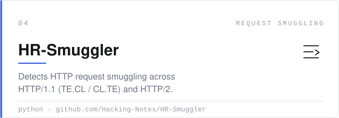
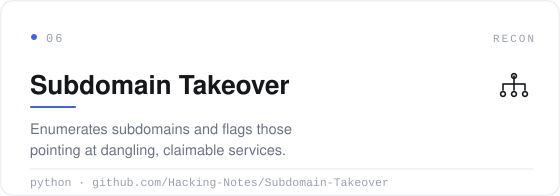

<a name="top"></a>

<div align="center">


<br />

<a href="https://github.com/Hacking-Notes"></a>
<a href="https://hacking-notes.com"></a>
<a href="https://hacking-notes.medium.com/"></a>
<a href="https://discord.gg/r68ameNHrD"></a>

<br /><br />


</div>

<br />

```console
$ whoami
Passionate cyber security enthusiast — building tools, breaking apps,
and documenting the path from script kiddie to security professional.

$ cat ~/.motto
"True power lies in the ability to see what others cannot."
```

<div align="center">


</div>


## 🚀 Featured Projects

<div align="center">

<a href="https://hacking-notes.com"></a>
<a href="https://github.com/Hacking-Notes/Hacker-Roadmap"></a>

<a href="https://github.com/Hacking-Notes/ClickMe"></a>
<a href="https://github.com/Hacking-Notes/HR-Smuggler"></a>

<a href="https://github.com/Hacking-Notes/Burp-Suite-Obsidian-Integration"></a>
<a href="https://github.com/Hacking-Notes/Subdomain-Takeover"></a>

</div>


## 🧰 The Arsenal

<div align="center">

<a href="https://github.com/Hacking-Notes/jwt"></a>
<a href="https://github.com/Hacking-Notes/lazy-js"></a>
<a href="https://github.com/Hacking-Notes/Wayback-Crawler"></a>
<a href="https://github.com/Hacking-Notes/Endpoint-Javascript-Explorer"></a>
<a href="https://github.com/Hacking-Notes/dcj-action"></a>

<a href="https://github.com/Hacking-Notes/Extensions"></a>
<a href="https://github.com/Hacking-Notes/Bookmarks"></a>
<a href="https://github.com/Hacking-Notes/VulnScan"></a>
<a href="https://github.com/Hacking-Notes/BSCP"></a>
<a href="https://github.com/Hacking-Notes/CVE"></a>

</div>


## 🎯 Contributions

<div align="center">

<a href="https://bug-bounty.blog/"></a>

<br /><br />

<a href="https://github.com/Hacking-Notes/CVE"></a>

</div>


<div align="right"><a href="#top">⬆ back to top</a></div>
